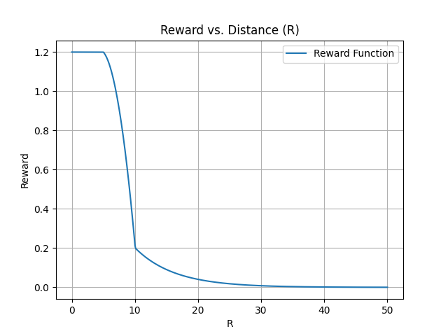

# train: dodge missile
记录训练设置、结果和总结  
train_jsbsim.py 设置参数为下，
> 北纬1度大概为111公里，0.17度大概18.9公里  
> 北纬60度附近，经度差1度大约111.32×cos(60°)=111.32×0.5=55.66km  
> 南北纬度距离基本上不变，东西经度要看维度，因为有个cos  

## 发射规则 
shoot_flag = agent.is_alive   
np.sum(self.lock_duration[agent_id]) >= self.lock_duration[agent_id].maxlen：保持锁定超过1秒  
distance <= self.max_attack_distance：进入最大距离14000m  
self.remaining_missiles[agent_id] > 0：有弹  
shoot_interval >= self.min_attack_interval：距离上次发射间隔大于25s  

## 设置：
+ 似乎不需要从远方飞过来或者对准之类的
+ 直接打就完了
+ 随机方向，距离，高度，速度，
+ 记录：

1. 设置初始条件：在singlecombat_env.py中reset_simulator函数中实现
2. 自己的随机初始高度和速度吗？先不随机
3. 敌方距离在9000到14000米，朝向对准圆心，速度从400到1000英尺每秒
4. 在singlecombat_with_missile_task.py中修改了shoot_flag产生规则：
5. 自己存活且有弹就发射

奖励：
+ Posture_reward: 
  + range_reward: 
  + orientation: 视线角越小，奖励越大，敌方视线角小于pi/2，给负奖励，
+ missile_reward:
  + 奖励同向拉开，导弹降速就给奖励，降的越快给越多
  + 惩罚反向对冲，导弹降速就惩罚小一点
+ AltitudeReward 低于安全高度给负奖励，还向下飞就给速度的负奖励
+ event 被击中给-200的大惩罚
+ EndRelativeAltitude: 敌方导弹速度低于声速时，相对高度越高越好
+ 

## 参数：
--env-name
SingleCombat
--algorithm-name
ppo
--scenario-name
1v1/ShootMissile/HierarchySelfplay
--experiment-name
v1
--seed
1
--n-training-threads
1
--n-rollout-threads
32
--cuda
--log-interval
1
--save-interval
1
--use-selfplay
--selfplay-algorithm
fsp
--n-choose-opponents
1
--use-eval
--n-eval-rollout-threads
1
--eval-interval
1
--eval-episodes
1
--num-mini-batch
5
--buffer-size
3000
--num-env-steps
1e8
--lr
3e-4
--gamma
0.99
--ppo-epoch
4
--clip-params
0.2
--max-grad-norm
2
--entropy-coef
1e-3
--hidden-size
128
128
--act-hidden-size
128
128
--recurrent-hidden-size
128
--recurrent-hidden-layers
1
--data-chunk-length
8
--use-prior